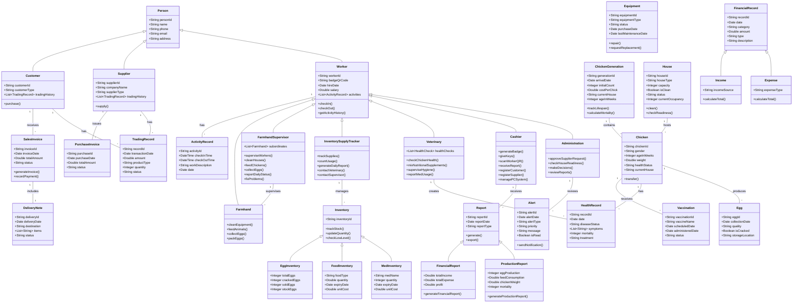

# Poultry Farm Management System
## Class Diagram

```mermaid
classDiagram
    %% Personnel Classes
    class Person {
        +String personId
        +String name
        +String phone
        +String email
        +String address
    }
    
    class Worker {
        +String workerId
        +String badgeQrCode
        +Date hireDate
        +Double salary
        +List~ActivityRecord~ activities
        +checkIn()
        +checkOut()
        +getActivityHistory()
    }
    
    class Administration {
        +approveSupplierRequest()
        +checkHouseReadiness()
        +makeDecisions()
        +reviewReports()
    }
    
    class Cashier {
        +generateBadge()
        +giveKeys()
        +scanWorkerQR()
        +receiveReport()
        +registerCustomer()
        +registerSupplier()
        +managePCSystem()
    }
    
    class Veterinary {
        +checkChickenHealth()
        +mixNutritionalSupplements()
        +superviseHygiene()
        +reportMedUsage()
        +List~HealthCheck~ healthChecks
    }
    
    class InventorySupplyTracker {
        +trackSupplies()
        +countUsage()
        +generateDailyReport()
        +contactVeterinary()
        +contactSupervisor()
    }
    
    class FarmhandSupervisor {
        +superviseWorkers()
        +cleanHouses()
        +feedChickens()
        +collectEggs()
        +reportDailyStatus()
        +fixProblems()
        +List~Farmhand~ subordinates
    }
    
    class Farmhand {
        +cleanEquipment()
        +feedAnimals()
        +collectEggs()
        +packEggs()
    }
    
    class ActivityRecord {
        +String activityId
        +DateTime checkInTime
        +DateTime checkOutTime
        +String workDescription
        +Date date
    }
    
    %% Trading Partner Classes
    class Supplier {
        +String supplierId
        +String companyName
        +String supplierType
        +List~TradingRecord~ tradingHistory
        +supply()
    }
    
    class Customer {
        +String customerId
        +String customerType
        +List~TradingRecord~ tradingHistory
        +purchase()
    }
    
    class TradingRecord {
        +String recordId
        +Date transactionDate
        +Double amount
        +String productType
        +Integer quantity
        +String status
    }
    
    %% Livestock Classes
    class ChickenGeneration {
        +String generationId
        +Date arrivalDate
        +Integer initialCount
        +Double costPerChick
        +String currentHouse
        +Integer ageInWeeks
        +trackLifespan()
        +calculateMortality()
    }
    
    class Chicken {
        +String chickenId
        +String gender
        +Integer ageInWeeks
        +Double weight
        +String healthStatus
        +String currentHouse
        +transfer()
    }
    
    class Egg {
        +String eggId
        +Date collectionDate
        +String quality
        +Boolean isCracked
        +String storageLocation
    }
    
    %% Infrastructure Classes
    class House {
        +String houseId
        +String houseType
        +Integer capacity
        +Boolean isClean
        +String status
        +Integer currentOccupancy
        +clean()
        +checkReadiness()
    }
    
    class Equipment {
        +String equipmentId
        +String equipmentType
        +String status
        +Date purchaseDate
        +Date lastMaintenanceDate
        +repair()
        +requestReplacement()
    }
    
    %% Inventory Classes
    class Inventory {
        +String inventoryId
        +trackStock()
        +updateQuantity()
        +checkLowLevel()
    }
    
    class MedInventory {
        +String medName
        +Integer quantity
        +Date expiryDate
        +Double unitCost
    }
    
    class FoodInventory {
        +String foodType
        +Double quantity
        +Date expiryDate
        +Double unitCost
    }
    
    class EggInventory {
        +Integer totalEggs
        +Integer crackedEggs
        +Integer soldEggs
        +Integer stockEggs
    }
    
    %% Financial Classes
    class FinancialRecord {
        +String recordId
        +Date date
        +String category
        +Double amount
        +String type
        +String description
    }
    
    class Expense {
        +String expenseType
        +calculateTotal()
    }
    
    class Income {
        +String incomeSource
        +calculateTotal()
    }
    
    %% Health Management Classes
    class HealthRecord {
        +String recordId
        +Date date
        +String diseaseStatus
        +List~String~ symptoms
        +Integer mortality
        +String treatment
    }
    
    class Vaccination {
        +String vaccinationId
        +String vaccineName
        +Date scheduledDate
        +Date administeredDate
        +String status
    }
    
    %% Sales Classes
    class SalesInvoice {
        +String invoiceId
        +Date invoiceDate
        +Double totalAmount
        +String status
        +generateInvoice()
        +recordPayment()
    }
    
    class DeliveryNote {
        +String deliveryId
        +Date deliveryDate
        +String destination
        +List~String~ items
        +String status
    }
    
    class PurchaseInvoice {
        +String purchaseId
        +Date purchaseDate
        +Double totalAmount
        +String status
    }
    
    %% Report Classes
    class Report {
        +String reportId
        +Date reportDate
        +String reportType
        +generate()
        +export()
    }
    
    class ProductionReport {
        +Integer eggProduction
        +Double feedConsumption
        +Double chickenWeight
        +Integer mortality
        +generateProductionReport()
    }
    
    class FinancialReport {
        +Double totalIncome
        +Double totalExpense
        +Double profit
        +generateFinancialReport()
    }
    
    %% Alert System
    class Alert {
        +String alertId
        +Date alertDate
        +String alertType
        +String priority
        +String message
        +Boolean isRead
        +sendNotification()
    }
    
    %% Relationships - Inheritance
    Person <|-- Worker
    Person <|-- Supplier
    Person <|-- Customer
    Worker <|-- Administration
    Worker <|-- Cashier
    Worker <|-- Veterinary
    Worker <|-- InventorySupplyTracker
    Worker <|-- FarmhandSupervisor
    Worker <|-- Farmhand
    Inventory <|-- MedInventory
    Inventory <|-- FoodInventory
    Inventory <|-- EggInventory
    FinancialRecord <|-- Expense
    FinancialRecord <|-- Income
    Report <|-- ProductionReport
    Report <|-- FinancialReport
    
    %% Relationships - Associations
    Worker "1" -- "*" ActivityRecord : has
    FarmhandSupervisor "1" -- "*" Farmhand : supervises
    Supplier "1" -- "*" TradingRecord : has
    Customer "1" -- "*" TradingRecord : has
    ChickenGeneration "1" -- "*" Chicken : contains
    House "1" -- "*" Chicken : hosts
    Veterinary "1" -- "*" HealthRecord : creates
    Chicken "1" -- "*" Egg : produces
    Chicken "1" -- "*" HealthRecord : has
    Chicken "1" -- "*" Vaccination : receives
    Customer "1" -- "*" SalesInvoice : receives
    SalesInvoice "1" -- "1" DeliveryNote : includes
    Supplier "1" -- "*" PurchaseInvoice : issues
    InventorySupplyTracker "1" -- "*" Inventory : manages
    Cashier "1" -- "*" Report : receives
    Administration "1" -- "*" Alert : reviews
```
